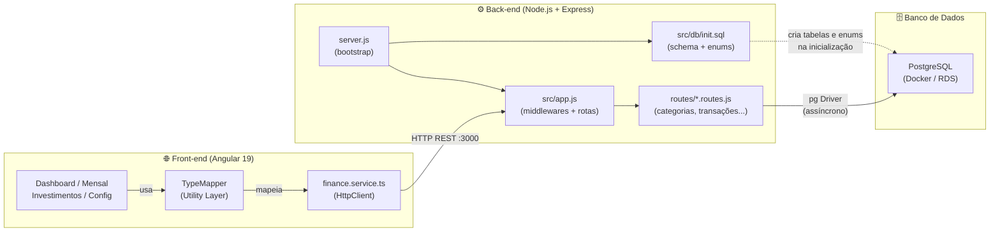

# 💰 Finance Manager

Bem-vindo ao **Finance Manager**! Um gerenciador financeiro pessoal moderno e intuitivo, desenvolvido para ajudar você a assumir o controle total das suas finanças, acompanhar gastos diários, gerenciar faturas de cartão de crédito e monitorar a evolução dos seus investimentos mês a mês com facilidade.

---

## 📖 Descrição do Projeto

O **Finance Manager** é uma aplicação Full-Stack composta por uma interface interativa (Front-end) desenvolvida nas melhores e mais recentes práticas do **Angular** e uma API (Back-end) robusta e rápida em **Node.js**.

O objetivo do sistema é permitir o gerenciamento de:
- 📉 **Gastos Avulsos, Fixos e Parcelados:** com cálculos automáticos baseados no período financeiro configurável focado no dia do seu pagamento.
- 📈 **Receitas:** salários, dividendos, etc.
- 💳 **Cartão de Crédito:** controle integrado de gastos.
- 🏦 **Investimentos:** aportes e resgates separados do seu saldo rotineiro de conta.
- 📊 **Dashboards Dinâmicos:** visualização em gráficos ricos separando transações por método e por categorias criadas dinamicamente (com seleção de emojis).

---

## 🏛️ Arquitetura do Sistema

O Finance Manager segue uma arquitetura **cliente-servidor** clássica de três camadas: o front-end Angular se comunica eletronicamente com a API REST via HTTP. A API é a única responsável pela persistência no banco de dados **PostgreSQL**.



> **Nota:** O sistema foi migrado de SQLite para PostgreSQL para suportar maior escalabilidade, tipos de dados precisos (DECIMAL) e Enums nativos. O Frontend utiliza um `TypeMapper` para garantir que os dados decimais sejam tratados como números precisos em toda a interface.

---

## 🛠️ Dados Técnicos

O projeto utiliza tecnologias modernas de desenvolvimento web e é completamente conteinerizado para facilitar a execução e deploy.

### 🌐 Front-end:
- **Framework:** Angular 19 (Standalone Components)
- **Camada de Dados:** `TypeMapper` para normalização de strings PostgreSQL para Number.
- **Estilização:** SCSS / CSS Vanilla com Bootstrap 5.3 + Animate.css.
- **Estruturação:** Padrão LIFT e Tipagem Estrita (Enums de String).
- **Servidor (Docker):** Nginx (Alpine).

### ⚙️ Back-end:
- **Plataforma:** Node.js v20+ / Express.js
- **Driver de Banco:** `pg` (PostgreSQL Client) com suporte a Connection Pool.
- **Banco de Dados:** PostgreSQL (Tabelas normalizadas, Enums e suporte a JSONB).
- **Arquitetura API:** RESTful assíncrona.

### 🐳 DevOps & Deploy:
- **Containerização:** Docker & Docker Compose (`docker-compose.yml`).
- **Banco de Dados:** Imagem oficial `postgres:15-alpine`.

---

## 🚀 Como Executar

O projeto é completamente orquestrado via **Docker Compose**, simplificando a inicialização do Front-end, Back-end e o Banco de Dados PostgreSQL.

### 1️⃣ Pré-requisitos
- Instalado em sua máquina: [Docker](https://docs.docker.com/get-docker/) e [Docker Compose](https://docs.docker.com/compose/install/).
- Portas `80` (Web) e `3000` (API) disponíveis.

### 2️⃣ Rodando via Docker (Recomendado)
Basta abrir no terminal a pasta raiz do projeto e digitar:

```bash
docker compose up -d --build
```
> O Docker Compose irá subir automaticamente:
> 1. Uma instância do **PostgreSQL 15**.
> 2. O **Back-end** (Node.js) que executará as migrations iniciais.
> 3. O **Front-end** (Angular) servido pelo Nginx.

### 🎉 Acessando:
- Aplicação Front-end: **[http://localhost](http://localhost)**
- API Back-end: **http://localhost:3000**

---

### Executando Manualmente (Modo Desenvolvimento)
Se preferir rodar localmente (necessita PostgreSQL externo):
1. **Configuração do Banco:**
   - Certifique-se de ter um PostgreSQL rodando e crie um banco chamado `finance_manager`.
   - Configure as variáveis no arquivo `back-end/.env`.

2. **Back-end:**
   ```bash
   cd back-end
   npm install
   npm start
   ```
3. **Front-end:**
   ```bash
   npm install
   npm start
   ```
Acesse `http://localhost:4200` para a versão de desenvolvimento do front.

---

## ⚙️ Back-end — API REST Node.js

### O que é

O back-end é uma **API REST** construída sobre **Node.js + Express.js** que serve como a única ponte de comunicação entre o front-end Angular e o banco de dados **PostgreSQL**. Ela é responsável por toda a lógica de persistência e regras de negócio: gestão de categorias, contas, transações automáticas e investimentos.

### Como executar

A partir da **raiz do projeto**, basta utilizar o Docker Compose (Recomendado):

```bash
docker compose up -d
```

Ou manualmente (após configurar o `.env`):
```bash
npm start --prefix back-end
```

### Estrutura de pastas

```
back-end/
├── server.js              # Ponto de entrada: Conecta ao banco e inicia o servidor
├── package.json
├── src/
│   ├── app.js             # Configura Express, CORS e monta todos os routers
│   ├── db/
│   │   ├── database.js    # Pool de conexões PostgreSQL (pg driver)
│   │   └── init.sql       # Script de Schema: tabelas, enums e sementes iniciais
│   └── routes/
│       ├── categorias.routes.js
│       ├── contas.routes.js     # Evolução de metodos-pagamento
│       ├── transacoes.routes.js
│       ├── configuracoes.routes.js
│       ├── investimentos.routes.js
│       └── saldo.routes.js
```

### Endpoints principais

| Método | Rota | Descrição |
|--------|------|-----------|
| `GET` | `/categorias` | Lista categorias (Gasto/Receita) |
| `GET` | `/contas` | Lista contas (Carteira/Crédito/Investimento) |
| `GET` | `/transacoes` | Lista transações filtradas por período |
| `POST` | `/transacoes` | Cria transação (Avulsa/Fixa/Parcelada) |
| `GET` | `/saldo-acumulado` | Calcula saldo real vs projeção |

---

### 🔄 Persistência e Integridade

A estrutura do banco de dados é inicializada automaticamente via `src/db/init.sql`. Diferente do SQLite, o PostgreSQL nos permite usar **Enums nativos** e **DECIMAL(15,2)**, garantindo que não haja erros de arredondamento em cálculos financeiros críticos.

Toda a comunicação é **assíncrona**, utilizando o driver `pg` com pooling de conexões para máxima performance e resiliência.
 Antes de executar qualquer `ALTER TABLE`, o código verifica se a coluna já existe — evitando erros em bancos de dados de usuários antigos que já a possuem.

> **Em resumo:** as migrations garantem que qualquer pessoa que baixe o projeto e rode `node server.js` terá o banco de dados criado e pronto para uso sem nenhuma configuração manual, e que usuários antigos não perderão seus dados ao atualizar.

---

## 🏗️ Estrutura Sistêmica

O projeto adere às práticas rigorosas de estruturação modular e **Clean Architecture** impostas pelo ecossistema do Angular. A hierarquia respeita a separação de código genérico (Core) e código relacionado às rotas e casos de uso (Features).

### 📁 Raiz (`/`)
- `/back-end`: Contém toda a API REST, o banco SQLite e os módulos de lógica do servidor.
- `/src/app/`: Central do código front-end Angular.

---

### 🧠 A pasta `Core` (`src/app/core/`)
O núcleo do Front-end. Aqui repousam códigos que serão utilizados por todo o sistema (Singleton), mas que não possuem relação direta com componentes visuais.
- **`models/`**: Definições estritas de tipagem (Interfaces TypeScript). Informam quais colunas/variáveis o frontend deve esperar para `Transacao`, `Categoria`, `Gasto`, `Periodo`, etc.
- **`services/`**: Camada comunicadora que abstrai requisições HTTP (com `HttpClient`) e estados.
  - *Ex:* `finance.service.ts` atua como ponte de acesso universal a todos os endpoints do back-end (`/transacoes`, `/categorias`, etc.), abstraindo o consumo das APIs no resto da aplicação.

### 🧩 A pasta `Features` (`src/app/features/`)
As _Features_ comportam módulos da nossa aplicação interligados às rotas. Cada pasta dentro de views é um "smart component" independente do fluxo.
Módulos contidos:
1. **`dashboard/`**: Componente visual robusto de resumo de conta. Consolida receitas vs despesas e exibe estatísticas em gráficos circulares interativos, isolando lógicas de agrupamento de array por métodos e categorias.
2. **`mensal/`**: ("Controle de Gastos"). Principal tela de inclusão que carrega a listagem geral listada temporalmente via API REST por período customizado. Controla injeções de receitas, parcelamentos de cartão, despesas fixas e edição das mesmas.
3. **`investimentos/`**: Concentra módulos para aportes de capital fora do orçamento rotineiro e resgates aplicados.
4. **`configuracoes/`**: Centro nervoso de set-ups do usuário. Controla o período inicial do mês financeiro customizável (ex: Mês de competência de quem recebe dia 5 e fatura vence dia 10), além da criação ou edição de tags universais (Categorias e Métodos de Pagamento + Seletor de Ícones Emoji).

---

## 🧪 Testes

A qualidade do **Finance Manager** é assegurada por uma estratégia híbrida de testes. Abaixo, detalhamos a diferença entre as abordagens utilizadas na aplicação.

### 🤖 Diferença entre as Abordagens
- **Testes Unitários**: Focam em validar a menor unidade de código testável (como um método de um serviço ou um componente Angular) de forma isolada, garantindo que a lógica interna e comportamentos específicos estejam corretos.
- **Testes Automatizados (Integração)**: Verificam se diferentes módulos e sistemas funcionam bem em conjunto (ex: Fluxo Completo da API salvando no Banco de Dados), simulando cenários reais de uso.

---

### 🧪 Testes Unitários

Garantem a integridade da lógica de negócio e cálculos financeiros em nível de código.

#### 🛠️ Bibliotecas e Ferramentas
| Projeto | Biblioteca | Versão | Descrição |
| :--- | :--- | :--- | :--- |
| **Back-end** | [Jest](https://jestjs.io/) | `^30.3.0` | Framework de testes completo: runner, assertions e cobertura (LCOV). |
| **Front-end** | [Jasmine](https://jasmine.github.io/) | `~5.6.0` | Framework BDD para definição de expectativas e criação de mocks. |
| **Front-end** | [Karma](https://karma-runner.github.io/) | `~6.4.0` | Test runner que executa os testes em navegadores reais ou headless. |

#### 📊 Cobertura alcançada
| Projeto | Cobertura de Linhas | Status |
| :--- | :--- | :--- |
| **Back-end** | **91.11%** | ✅ Aprovado |
| **Front-end** | **91.70%** | ✅ Aprovado |

#### 🚀 Como executar
```bash
# Back-end
cd back-end && npm run test:coverage

# Front-end (na raiz)
npx ng test --no-watch --code-coverage
```

---

### 🤖 Testes Automatizados (Integração)

Validam a comunicação entre as camadas do sistema e a API REST.

#### 🛠️ Bibliotecas e Ferramentas
| Projeto | Biblioteca | Versão | Descrição |
| :--- | :--- | :--- | :--- |
| **Back-end** | [Jest](https://jestjs.io/) | `^30.3.0` | Utilizado aqui para orquestrar a execução das rotas e validação de status codes. |
| **Back-end** | [Supertest](https://github.com/ladjs/supertest) | `^7.2.2` | Agente HTTP que simula requisições reais aos endpoints para validar o payload. |

#### 🚀 Como executar
```bash
# Back-end
cd back-end && npm test
```

---

**O que é testado:**
- No **Back-end**, validamos o ciclo completo de transações, cálculos de saldo acumulado e CRUD de categorias/investimentos em um banco PostgreSQL isolado.
- No **Front-end**, testamos serviços de comunicação (FinanceService), lógica de manipulação de estados do `MensalComponent` e a integridade da UI do Angular.

---

## ℹ️ Informações Adicionais

### 🎨 Funcionalidade de Upload de Ícones
Para oferecer uma experiência premium e personalizada, o **Finance Manager** permite que o usuário adicione seus próprios logotipos de bancos ou ícones de categorias que não estão no set padrão de emojis.

**Como utilizar:**
1. Vá até a tela de **Configurações**.
2. Na seção "Importar Ícone .SVG", escolha um arquivo do seu computador (formatos suportados: `.svg`, `.png`, `.ico`).
3. Clique em **Subir**. O ícone aparecerá na lista de "Ícones Importados".
4. Ao criar ou editar uma Categoria ou Método de Pagamento, clique no botão de ícone para abrir o seletor. Seus ícones importados estarão no topo da lista!

### 📦 Biblioteca de Persistência de Arquivos
Para gerenciar o recebimento e armazenamento dos ícones no servidor, utilizamos a biblioteca **Multer**.

- **Versão:** `^2.1.1`
- **O que é:** O **Multer** é um middleware para **Node.js** especializado no tratamento de corpos de requisições `multipart/form-data`. Ele é essencial para o upload de arquivos, permitindo que a API receba fluxos de dados binários (como imagens), valide formatos e salve os arquivos de forma organizada em pastas específicas do disco, tornando-os disponíveis como ativos estáticos para o Front-end.

---


