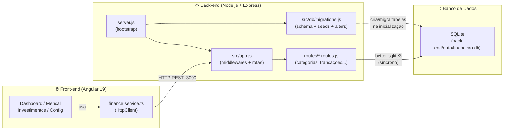

# 💰 Finance Manager

Bem-vindo ao **Finance Manager**! Um gerenciador financeiro pessoal moderno e intuitivo, desenvolvido para ajudar você a assumir o controle total das suas finanças, acompanhar gastos diários, gerenciar faturas de cartão de crédito e monitorar a evolução dos seus investimentos mês a mês com facilidade.

---

## 📖 Descrição do Projeto

O **Finance Manager** é uma aplicação Full-Stack composta por uma interface interativa (Front-end) desenvolvida nas melhores e mais recentes práticas do **Angular** e uma API (Back-end) robusta e rápida em **Node.js**.

O objetivo do sistema é permitir o gerenciamento de:
- 📉 **Gastos Avulsos, Fixos e Parcelados:** com cálculos automáticos baseados no período financeiro configurável focado no dia do seu pagamento.
- 📈 **Receitas:** salários, dividendos, etc.
- 💳 **Cartão de Crédito:** controle integrado de gastos.
- 🏦 **Investimentos:** aportes e resgates separados do seu saldo rotineiro de conta.
- 📊 **Dashboards Dinâmicos:** visualização em gráficos ricos separando transações por método e por categorias criadas dinamicamente (com seleção de emojis).

---

## 🏛️ Arquitetura do Sistema

O Finance Manager segue uma arquitetura **cliente-servidor** clássica de três camadas: o front-end Angular se comunica exclusivamente com a API REST via HTTP, que por sua vez é a única responsável por ler e escrever no banco de dados SQLite local.



> **Nota:** O front-end nunca acessa o banco diretamente. Toda a inteligência de persistência e regras de negócio (criação de parcelas, geração de recorrências fixas, etc.) vive exclusivamente na API.

---

## 🛠️ Dados Técnicos

O projeto utiliza tecnologias modernas de desenvolvimento web e é completamente conteinerizado para facilitar a execução e deploy.

### 🌐 Front-end:
- **Framework:** Angular 19 (Standalone Components)
- **Estilização:** SCSS / CSS Vanilla com Bootstrap 5.3 (para grid e layouts utilitários básicos) + Animate.css para animações fluidas.
- **Estruturação:** Padrão LIFT (Locate, Identify, Flattest, Try to be DRY).
- **Servidor (Docker):** Nginx (Alpine).

### ⚙️ Back-end:
- **Plataforma:** Node.js v20+ / Express.js
- **Banco de Dados:** SQLite (com abstração _better-sqlite3_ para super performance de consultas síncronas/rápidas).
- **Arquitetura API:** RESTful com rotas separadas por domínio.

### 🐳 DevOps & Deploy:
- **Containerização:** Docker & Docker Compose (`docker-compose.yml`).

---

## 🚀 Como Executar

O projeto já está estruturado via Docker Compose, unificando tanto a aplicação Angular quanto o servidor Node.js e o banco SQLite de maneira automática.

### 1️⃣ Pré-requisitos
- Instalado em sua máquina: [Docker](https://docs.docker.com/get-docker/) e [Docker Compose](https://docs.docker.com/compose/install/).
- Porta `80` (Angular/Nginx) e `3000` (Node.js API) disponíveis na máquina host.

### 2️⃣ Rodando via Docker
Basta abrir no terminal a pasta raiz do projeto e digitar:

```bash
docker compose up -d --build
```
> O comando `--build` garante que as imagens fiquem atualizadas durante as reconstruções. Para acompanhar os logs, use `docker compose logs -f`.

### 🎉 Acessando:
- Aplicação Front-end: **[http://localhost](http://localhost)**
- API Back-end: **http://localhost:3000**

---

### Executando Manualmente (Modo Desenvolvimento)
Se preferir rodar sem o Docker:
1. **Back-end:**
   ```bash
   cd back-end
   npm install
   node server.js
   ```
2. **Front-end:**
   ```bash
   npm install
   npm start
   ```
Acesse `http://localhost:4200` para a versão de desenvolvimento do front.

---

## ⚙️ Back-end — API REST Node.js

### O que é

O back-end é uma **API REST** construída sobre **Node.js + Express.js** que serve como a única ponte de comunicação entre o front-end Angular e o banco de dados SQLite. Ela é responsável por toda a lógica de persistência: cadastro de categorias, métodos de pagamento, criação de transações (avulsas, fixas ou parceladas), controle de investimentos e configurações do usuário.

### Como executar

A partir da **raiz do projeto**, basta rodar:

```bash
node back-end/server.js
```

O servidor sobe na porta `3000` e exibe `✅ API rodando na porta 3000` no terminal. Todas as migrations de banco são executadas automaticamente antes do servidor começar a aceitar requisições.

### Estrutura de pastas

```
back-end/
├── server.js              # Ponto de entrada: executa migrations e inicia o servidor
├── package.json
├── src/
│   ├── app.js             # Configura Express, CORS e monta todos os routers
│   ├── db/
│   │   ├── database.js    # Singleton de conexão SQLite (better-sqlite3)
│   │   ├── migrations.js  # Engine de migrations: schema, seeds e alters
│   │   └── migrations/
│   │       ├── 001_schema.sql   # CREATE TABLE para todas as entidades
│   │       ├── 002_seed.sql     # Dados padrão de domínio e configurações
│   │       └── 003_alter.sql    # Documentação dos ALTER TABLE incrementais
│   └── routes/
│       ├── categorias.routes.js
│       ├── metodos-pagamento.routes.js
│       ├── transacoes.routes.js
│       ├── configuracoes.routes.js
│       ├── investimentos.routes.js
│       └── saldo.routes.js
└── data/
    └── financeiro.db      # Banco SQLite (gerado automaticamente)
```

### Endpoints disponíveis

| Método | Rota | Descrição |
|--------|------|-----------|
| `GET` | `/categorias` | Lista categorias |
| `POST` | `/categorias` | Cria categoria |
| `PUT` | `/categorias/:id` | Atualiza categoria |
| `DELETE` | `/categorias/:id` | Remove categoria |
| `GET` | `/metodos-pagamento` | Lista métodos de pagamento |
| `POST` | `/metodos-pagamento` | Cria método de pagamento |
| `PUT` | `/metodos-pagamento/:id` | Atualiza método |
| `DELETE` | `/metodos-pagamento/:id` | Remove método |
| `GET` | `/transacoes` | Lista transações (com filtros de data/período) |
| `GET` | `/transacoes/periodos` | Lista períodos (ano-mês) com transações |
| `POST` | `/transacoes` | Cria transação avulsa, fixa ou parcelada |
| `PUT` | `/transacoes/:id` | Atualiza transação |
| `DELETE` | `/transacoes/:id` | Remove transação (ou toda a recorrência com `?deleteAll=true`) |
| `GET` | `/configuracoes/periodo` | Retorna o dia de início do período financeiro |
| `PUT` | `/configuracoes/periodo` | Atualiza o dia de início do período |
| `GET` | `/investimentos` | Lista investimentos |
| `POST` | `/investimentos` | Registra investimento |
| `DELETE` | `/investimentos/:id` | Remove investimento |
| `GET` | `/saldo-acumulado` | Calcula saldo acumulado por método até uma data |

---

### 🔄 Migrations

**Migrations** são o mecanismo que garante que o banco de dados seja criado e mantido com a estrutura correta toda vez que a API é iniciada — seja a primeira vez, seja em um ambiente já existente com dados.

O módulo `src/db/migrations.js` é executado automaticamente no `server.js` antes do servidor começar a aceitar requisições, e funciona em três etapas:

#### 1. Schema (`001_schema.sql`)
Contém todos os `CREATE TABLE IF NOT EXISTS`. Na primeira execução, cria todas as tabelas do zero. Em execuções subsequentes, o `IF NOT EXISTS` garante que tabelas já existentes não sejam recriadas nem seus dados perdidos.

#### 2. Seeds (`002_seed.sql`)
Insere os dados padrão de domínio usando `INSERT OR IGNORE`, o que garante que os seeds rodem com segurança múltiplas vezes sem duplicar registros:
- Tipos de transação: `avulsa`, `fixa`, `parcelada`
- Direções: `gasto`, `receita`
- Configuração padrão: `dia_inicio_periodo = 1`

#### 3. Alters Incrementais (`migrations.js`)
Colunas adicionadas ao banco em versões mais novas da aplicação (como `direcao_id`, `icone`, `tipo`) são aplicadas programaticamente com proteção via `PRAGMA table_info`. Antes de executar qualquer `ALTER TABLE`, o código verifica se a coluna já existe — evitando erros em bancos de dados de usuários antigos que já a possuem.

> **Em resumo:** as migrations garantem que qualquer pessoa que baixe o projeto e rode `node server.js` terá o banco de dados criado e pronto para uso sem nenhuma configuração manual, e que usuários antigos não perderão seus dados ao atualizar.

---

## 🏗️ Estrutura Sistêmica

O projeto adere às práticas rigorosas de estruturação modular e **Clean Architecture** impostas pelo ecossistema do Angular. A hierarquia respeita a separação de código genérico (Core) e código relacionado às rotas e casos de uso (Features).

### 📁 Raiz (`/`)
- `/back-end`: Contém toda a API REST, o banco SQLite e os módulos de lógica do servidor.
- `/src/app/`: Central do código front-end Angular.

---

### 🧠 A pasta `Core` (`src/app/core/`)
O núcleo do Front-end. Aqui repousam códigos que serão utilizados por todo o sistema (Singleton), mas que não possuem relação direta com componentes visuais.
- **`models/`**: Definições estritas de tipagem (Interfaces TypeScript). Informam quais colunas/variáveis o frontend deve esperar para `Transacao`, `Categoria`, `Gasto`, `Periodo`, etc.
- **`services/`**: Camada comunicadora que abstrai requisições HTTP (com `HttpClient`) e estados.
  - *Ex:* `finance.service.ts` atua como ponte de acesso universal a todos os endpoints do back-end (`/transacoes`, `/categorias`, etc.), abstraindo o consumo das APIs no resto da aplicação.

### 🧩 A pasta `Features` (`src/app/features/`)
As _Features_ comportam módulos da nossa aplicação interligados às rotas. Cada pasta dentro de views é um "smart component" independente do fluxo.
Módulos contidos:
1. **`dashboard/`**: Componente visual robusto de resumo de conta. Consolida receitas vs despesas e exibe estatísticas em gráficos circulares interativos, isolando lógicas de agrupamento de array por métodos e categorias.
2. **`mensal/`**: ("Controle de Gastos"). Principal tela de inclusão que carrega a listagem geral listada temporalmente via API REST por período customizado. Controla injeções de receitas, parcelamentos de cartão, despesas fixas e edição das mesmas.
3. **`investimentos/`**: Concentra módulos para aportes de capital fora do orçamento rotineiro e resgates aplicados.
4. **`configuracoes/`**: Centro nervoso de set-ups do usuário. Controla o período inicial do mês financeiro customizável (ex: Mês de competência de quem recebe dia 5 e fatura vence dia 10), além da criação ou edição de tags universais (Categorias e Métodos de Pagamento + Seletor de Ícones Emoji).

---

## 🧪 Testes

A qualidade do **Finance Manager** é assegurada por uma estratégia híbrida de testes. Abaixo, detalhamos a diferença entre as abordagens utilizadas na aplicação.

### 🤖 Diferença entre as Abordagens
- **Testes Unitários**: Focam em validar a menor unidade de código testável (como um método de um serviço ou um componente Angular) de forma isolada, garantindo que a lógica interna e comportamentos específicos estejam corretos.
- **Testes Automatizados (Integração)**: Verificam se diferentes módulos e sistemas funcionam bem em conjunto (ex: Fluxo Completo da API salvando no Banco de Dados), simulando cenários reais de uso.

---

### 🧪 Testes Unitários

Garantem a integridade da lógica de negócio e cálculos financeiros em nível de código.

#### 🛠️ Bibliotecas e Ferramentas
| Projeto | Biblioteca | Versão | Descrição |
| :--- | :--- | :--- | :--- |
| **Back-end** | [Jest](https://jestjs.io/) | `^30.3.0` | Framework de testes completo: runner, assertions e cobertura (LCOV). |
| **Front-end** | [Jasmine](https://jasmine.github.io/) | `~5.6.0` | Framework BDD para definição de expectativas e criação de mocks. |
| **Front-end** | [Karma](https://karma-runner.github.io/) | `~6.4.0` | Test runner que executa os testes em navegadores reais ou headless. |

#### 📊 Cobertura alcançada
| Projeto | Cobertura de Linhas | Status |
| :--- | :--- | :--- |
| **Back-end** | **91.11%** | ✅ Aprovado |
| **Front-end** | **91.70%** | ✅ Aprovado |

#### 🚀 Como executar
```bash
# Back-end
cd back-end && npm run test:coverage

# Front-end (na raiz)
npx ng test --no-watch --code-coverage
```

---

### 🤖 Testes Automatizados (Integração)

Validam a comunicação entre as camadas do sistema e a API REST.

#### 🛠️ Bibliotecas e Ferramentas
| Projeto | Biblioteca | Versão | Descrição |
| :--- | :--- | :--- | :--- |
| **Back-end** | [Jest](https://jestjs.io/) | `^30.3.0` | Utilizado aqui para orquestrar a execução das rotas e validação de status codes. |
| **Back-end** | [Supertest](https://github.com/ladjs/supertest) | `^7.2.2` | Agente HTTP que simula requisições reais aos endpoints para validar o payload. |

#### 🚀 Como executar
```bash
# Back-end
cd back-end && npm test
```

---

**O que é testado:**
- No **Back-end**, validamos o ciclo completo de transações, cálculos de saldo acumulado e CRUD de categorias/investimentos em um banco SQLite isolado.
- No **Front-end**, testamos serviços de comunicação (FinanceService), lógica de manipulação de estados do `MensalComponent` e a integridade da UI do Angular.

---

## ℹ️ Informações Adicionais

### 🎨 Funcionalidade de Upload de Ícones
Para oferecer uma experiência premium e personalizada, o **Finance Manager** permite que o usuário adicione seus próprios logotipos de bancos ou ícones de categorias que não estão no set padrão de emojis.

**Como utilizar:**
1. Vá até a tela de **Configurações**.
2. Na seção "Importar Ícone .SVG", escolha um arquivo do seu computador (formatos suportados: `.svg`, `.png`, `.ico`).
3. Clique em **Subir**. O ícone aparecerá na lista de "Ícones Importados".
4. Ao criar ou editar uma Categoria ou Método de Pagamento, clique no botão de ícone para abrir o seletor. Seus ícones importados estarão no topo da lista!

### 📦 Biblioteca de Persistência de Arquivos
Para gerenciar o recebimento e armazenamento dos ícones no servidor, utilizamos a biblioteca **Multer**.

- **Versão:** `^2.1.1`
- **O que é:** O **Multer** é um middleware para **Node.js** especializado no tratamento de corpos de requisições `multipart/form-data`. Ele é essencial para o upload de arquivos, permitindo que a API receba fluxos de dados binários (como imagens), valide formatos e salve os arquivos de forma organizada em pastas específicas do disco, tornando-os disponíveis como ativos estáticos para o Front-end.

---


