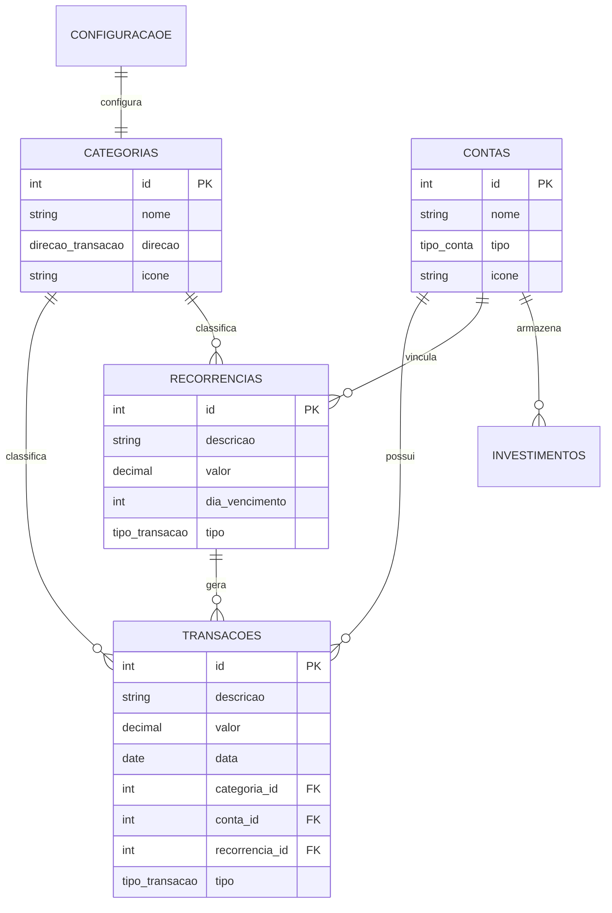
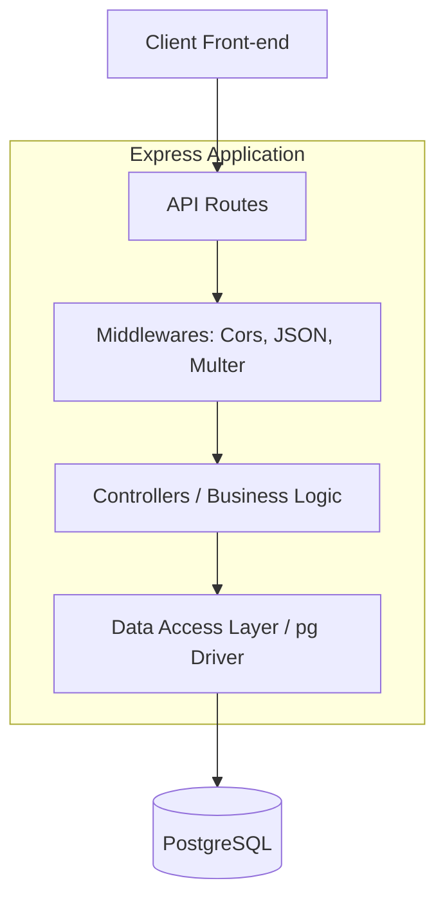

# ⚙️ Finance Manager API

Esta é a documentação da API REST do **Finance Manager**, o cérebro por trás da persistência e lógica de negócio do sistema de gestão financeira.

---

## 🤖 Desenvolvimento Orientado a IA

Este projeto foi desenvolvido **inteiramente por Inteligência Artificial (Antigravity)**. Desde a concepção da arquitetura, modelagem do banco de dados PostgreSQL, implementação das rotas REST até a criação da suíte de testes automatizados e esta própria documentação. O desenvolvimento seguiu práticas modernas de Clean Code, Modularidade e Tipagem Estrita.

---

## 📖 O que a API faz

A API do Finance Manager gerencia todo o ciclo de vida dos dados financeiros do usuário:
- **Gestão de Categorias e Contas**: Permite a criação e personalização de categorias (com ícones/emojis) e contas bancárias/métodos de pagamento.
- **Processamento de Transações**: Controla transações avulsas, fixas (mensais) e parceladas com lógica de atualização automática.
- **Cálculos Financeiros**: Computa saldos acumulados, projeções de fim de mês e consolidação de gastos por categoria.
- **Gestão de Investimentos**: Monitora aportes e resgates de forma isolada do saldo operacional.
- **Upload de Ativos**: Gerencia o armazenamento de ícones personalizados enviados pelo usuário.

---

## 📚 Bibliotecas e Versões

| Biblioteca | Versão | Função |
| :--- | :--- | :--- |
| **express** | `^4.21.1` | Framework web minimalista para Node.js, gerencia rotas e middlewares. |
| **pg** | `^8.20.0` | Driver cliente para PostgreSQL, suportando Connection Pool e consultas assíncronas. |
| **cors** | `^2.8.5` | Middleware para habilitar o compartilhamento de recursos entre diferentes origens (Security). |
| **dotenv** | `^17.3.1` | Carrega variáveis de ambiente a partir de um arquivo `.env` para segurança de credenciais. |
| **multer** | `^2.1.1` | Middleware para manipulação de `multipart/form-data`, utilizado no upload de ícones. |
| **jest** | `^30.3.0` | Framework de testes unitários e de integração com suporte a cobertura de código. |
| **supertest** | `^7.2.2` | Biblioteca para testar endpoints HTTP simulando requisições reais. |

---

## 🗄️ Banco de Dados e Estrutura

O sistema utiliza o **PostgreSQL**, um banco de dados relacional robusto e performático. A estrutura foi desenhada utilizando Enums nativos para integridade de dados e tipos decimais precisos para valores monetários.

### Estrutura de Tabelas e Relações



- **Enums Nativos**: `direcao_transacao` (gasto/receita), `tipo_conta` (carteira/credito/investimento) e `tipo_transacao` (avulsa/fixa/parcelada).
- **Tipos Decimais**: Todos os campos financeiros utilizam `DECIMAL(15,2)` para evitar erros de arredondamento de ponto flutuante.

---

## 🚀 Como Executar

### 1. Requisitos
- Node.js v20 ou superior.
- Instância do PostgreSQL rodando (ou via Docker).

### 2. Configuração
Crie um arquivo `.env` na pasta `back-end/` com as suas credenciais:
```env
DB_USER=seu_usuario
DB_HOST=localhost
DB_PASSWORD=sua_senha
DB_NAME=finance_manager
DB_PORT=5432
PORT=3000
```

### 3. Instalação e Execução
```bash
cd back-end
npm install
npm start
```

---

## 🧪 Testes Automatizados

A API possui uma cobertura rigorosa de testes unitários e de integração utilizando **Jest**.

### Como executar os testes:

```bash
# Rodar todos os testes
npm test

# Rodar com relatório de cobertura (Coverage)
npm run test:coverage
```

A cobertura atual do backend é superior a **90%**, validando desde as lógicas de cálculo de saldo até a integridade das rotas REST.

---

## 🏗️ Arquitetura do Sistema

A API segue o padrão de camadas para separação de preocupações:

